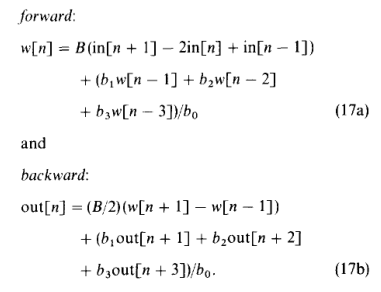
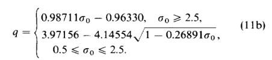
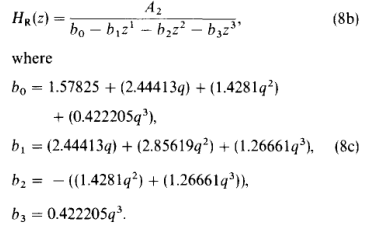

### 快速高斯模糊算法的原理以及webgl工程实现: https://github.com/forthealllight/blog/issues/58

评价：对于3 * 3或者5 * 5的高斯计算能保证在*有一定质量*的前提下提升*一部分计算性能*，但对于大型高斯计算堪称鬼片

### 根据文章：快速高斯模糊综述 https://lianera.github.io/post/2017/fast-gaussian/#%E9%80%92%E5%BD%92%E9%AB%98%E6%96%AF%E6%BB%A4%E6%B3%A2  尝试使用递归高斯滤波

### IIR递归高斯滤波 https://blog.csdn.net/yauphy1/article/details/102523787

 

